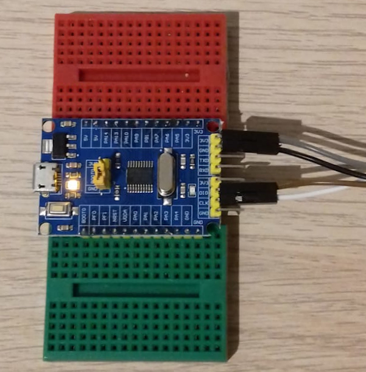

# Simple LED blinker.
## Description
Simple blinker written in Assembly. Using cheapest development board from ebay, about 1.19 GBP.



STM32F030F4P6 documentation from:
* https://www.st.com/content/ccc/resource/technical/document/reference_manual/cf/10/a8/c4/29/fb/4c/42/DM00091010.pdf/files/DM00091010.pdf/jcr:content/translations/en.DM00091010.pdf

## Compile and flash
After connecting the ST-LINK to the development board, execute the following commands:
```
$ make
$ make install
```
